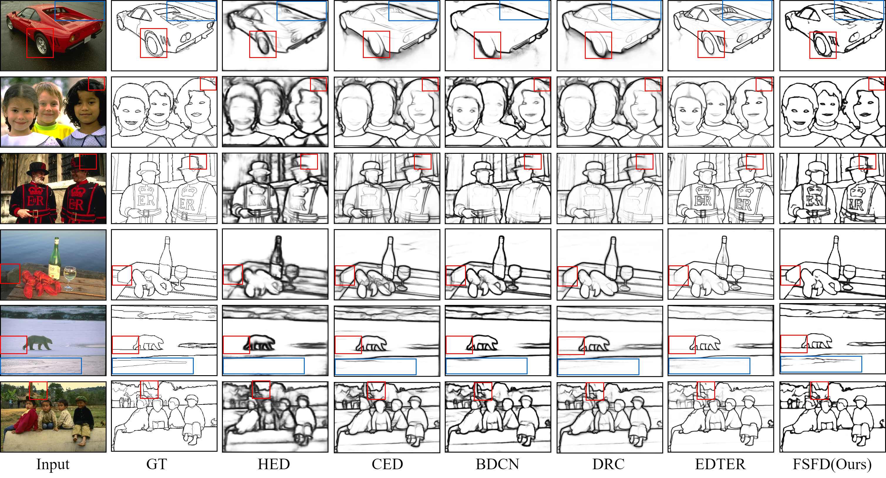
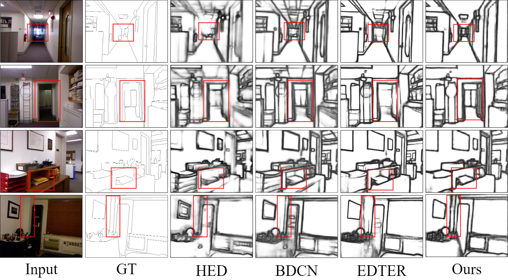
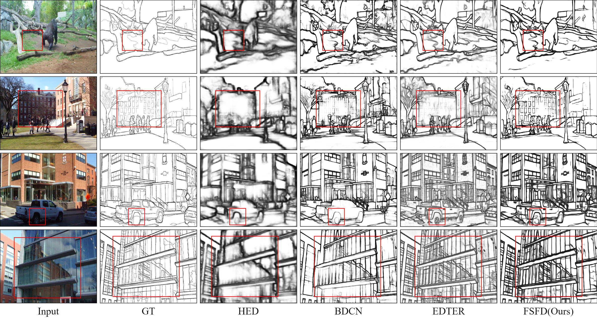

# FSFD: Boosting Edge Detection via Fusing Spatial and Frequency Domains


## The qualitative results of FSDS on four datasets. 

### BSDS500

<div style="text-align:center">
</div>

```diff
NYUD V2
```

<div style="text-align:center">
</div>

```diff
Multicue
```

<div style="text-align:center">
</div>


```diff
BIPED
```
<div style="text-align:center">
</div>

```diff
Edge detection datasets
```

* [BSDS500](https://www2.eecs.berkeley.edu/Research/Projects/CS/vision/bsds/), [NYUDV2](https://cs.nyu.edu/~silberman/datasets/nyu_depth_v2.html), [Multicue](http://serre-lab.clps.brown.edu/resource/multicue/) and [BIPED](https://xavysp.github.io/MBIPED/)

## The quantitative results of FSDS on four datasets.

<center>

| Dataset  | ODS      | OIS      | AP       |
| -------- | -------- | -------- | -------- |
| BSDS500  | `.828` | `.848` | `.889` |
| NYUDV2   | `.779` | `.795` | `.801` |
| Multicue | `.899` | `.907` | `.953` |
| BIPED    | `.907` | `.910` | `.951` |
